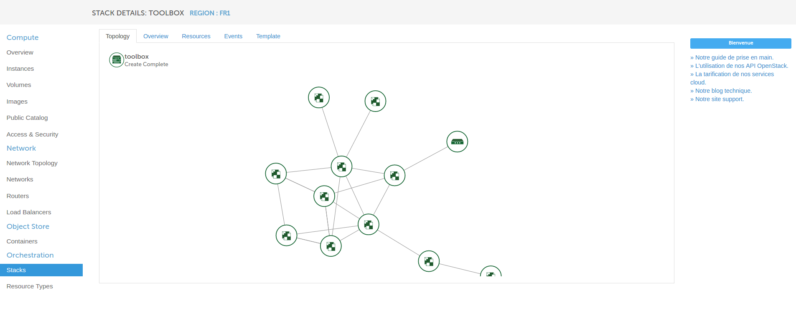
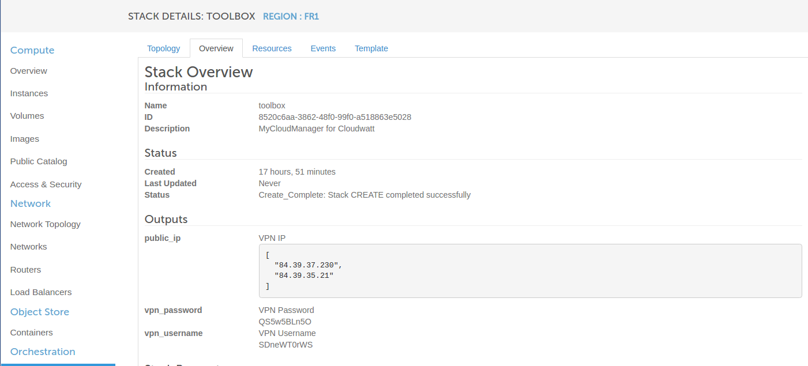
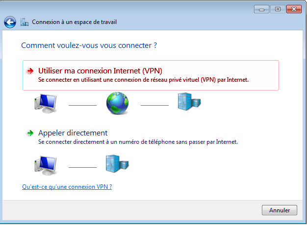
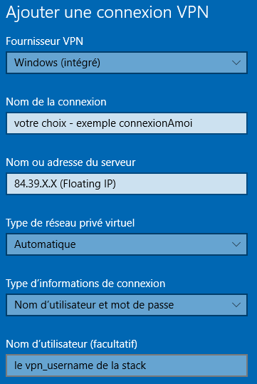
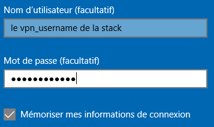
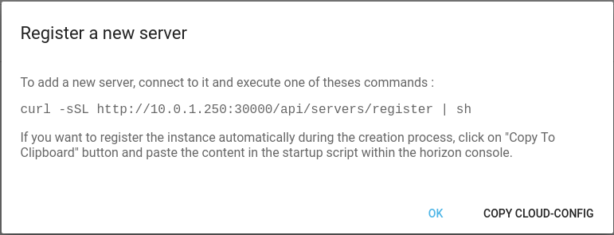

# Innovation Beta: MyCloudManager

Cette deuxième version de MyCloudManager (version Beta). Celle-ci a pour but de vous apporter un ensemble d'outils afin **d'unifier, d'harmoniser et monitorer votre tenant**. En effet celui-ci renferme un lot d'applications variées qui a pour vocation de vous aider dans la gestion au jour le jour de vos instances **Linux**:
* Monitoring et Supervision
* Log management
* Planificateur de taches
* Miroir Antivirus
* Gestionnaire de répertoire applicatif
* Synchronisation de temps

MyCloudManager a entièrement été développé par l'équipe CAT - Cloudwatt Automation Team.
* MyCloudManager est entièrement HA (Haute Dispo)
* Il repose sur une instance CoreOS
* L'ensemble des applications se déploient dans des conteneurs Docker orchestrés par Kubernetes
* L'interface utilisateur est developpé en React
* De plus vous pouvez installer ou configurer, depuis l'interface graphique, l'ensemble des applications sur vos instances via des playbooks Ansible
* Afin de sécuriser au maximum votre MyCloudManager, aucun port n'est exposé sur internet mis à part le port 22 pour le management des instances de la stack ainsi que le port 1723 pour l'accès VPN PPTP.

## Préparations

### Les pré-requis

 * Un accès internet
 * Un shell linux
 * Un [compte Cloudwatt](https://www.cloudwatt.com/cockpit/#/create-contact) avec une [ paire de clés existante](https://console.cloudwatt.com/project/access_and_security/?tab=access_security_tabs__keypairs_tab)
 * Les outils [OpenStack CLI](http://docs.openstack.org/cli-reference/content/install_clients.html)

### Initialiser l'environnement

Munissez-vous de vos identifiants Cloudwatt, et cliquez [ICI](https://console.cloudwatt.com/project/access_and_security/api_access/openrc/).
Si vous n'êtes pas connecté, vous passerez par l'écran d'authentification, puis le téléchargement d'un script démarrera. C'est grâce à celui-ci que vous pourrez initialiser les accès shell aux API Cloudwatt.

Sourcez le fichier téléchargé dans votre shell et entrez votre mot de passe lorsque vous êtes invité à utiliser les clients OpenStack.

 ~~~ bash
 $ source COMPUTE-[...]-openrc.sh
 Please enter your OpenStack Password:
 ~~~

Une fois ceci fait, les outils de ligne de commande d'OpenStack peuvent interagir avec votre compte Cloudwatt.

## Installer MyCloudManager

### Le 1-clic

MyCloudManager se lance par le **1-clic** de **Cloudwatt** via la page web
[Applications](https://www.cloudwatt.com/fr/applications/index.html) du site de Cloudwatt. Choisissez l'application MyCloudManager et appuyez sur **DEPLOYER**.

Après avoir entré vos login/password de votre compte, le wizard de lancement apparait :

Comme vous avez pu le constater le wizard du 1-Clic vous demande de saisir une nouvelle fois vos identifiants Openstack (cela sera fixé lors d'une prochaine version de MyCloudManager).
Vous trouverez [ici](https://console.cloudwatt.com/project/access_and_security/api_access/view_credentials/) votre **tenant ID**, il est identique a l'**ID du projet**. Il vous sera nécessaire pour compléter le wizard.

Par défaut, le wizard propose un déploiement de deux instances de type "small-1" qui seront les instances `masters`, celles-ci sont nécessaire au bon fonctionnement de kubernetes en HA. Concernant les `nodes`, ils porterons l'ensemble des *"pods" (applications)* déployés sur la stack ceux-ci doivent être taillés en fonction de l'utilisation que vous souhaitez faire de MyCloudManager par défaut il vous ait proposé de les déployer sur des flavor de type "n2.cw.standart-1".

Vous verrez par la suite que 3 instances de type "tiny" seront aussi créées, celles-ci permettent à kubernetes de connaitre l'ensemble des noeuds et application qui compose le cluster déployé.

Cependant il existe une variété d'autres types d'instances pour la satisfaction de vos multiples besoins. Les instances sont facturées à la minute, vous permettant de payer uniquement pour les services que vous avez consommés et plafonnées à leur prix mensuel (vous trouverez plus de détails sur la [Page tarifs](https://www.cloudwatt.com/fr/produits/tarifs.html) du site de Cloudwatt).

Afin de persister les données applicative, des volumes de type standard seront crées dans votre tenant et attacher automatiquement à votre stack au déploiement de chaque applications, grâce à kubernetes, afin de contenir l'ensemble des données de vos différentes applications.

Par défault, MyCloudManager sera déployé sur 2 instance *master* avec 3 instance *worker* et 3 instance *etcd*.

Appuyer sur **LANCER**.

Le **1-clic** s'occupe de lancer les appels nécessaires sur les API Cloudwatt pour :

* démarrer l'ensemble des instances du cluster basée sur CoreOS
* lancer le conteneur **toolbox-backend**,
* lancer le conteneur **toolbox-frontend**,
* lancer le conteneur **rethinkdb**,
* lancer le conteneur **rabbitmq**,
* lancer le conteneur **traefik**

La stack se crée automatiquement. Vous pouvez en voir la progression en cliquant sur son nom ce qui vous menera à la console Horizon. Quand tous les modules deviendront « verts », la création sera terminée.

Attendez **5 minutes** que l'ensemble soit complètement initialisé.

### Finaliser l'accès VPN

Afin d'avoir accès à l'ensemble des fonctionnalitées, nous avons mis en place une connexion VPN.

Voici la démarche à suivre :

* Dans un premier temps, récupérez les informations de sortie de votre stack,

#### Windows 7

* Il faut maintenant créer une connexion VPN depuis votre poste, rendez-vous dans "le panneau de configuration > Tous les Panneaux de configuration > Centre Réseau et partage". Cliquez ensuite sur "Configurer une nouvelle connexion ..... "

* Entrez à présent les informations récupérées en sortie de la stack : dans un premier temps la *FloatingIP*, puis le *login* et ensuite le *mot de passe* fournis.

Après avoir suivi cette procédure vous pouvez maintenant lancer la connexion VPN.

-----
#### Windows 10

* rendez-vous dans Paramètres > RESEAU ET INTERNET > Réseau privé virtuel

* Entrez à présent les informations récupérées en sortie de la stack : dans un premier temps la *FloatingIP*, puis le *login* et ensuite le *mot de passe* fournis.

Après avoir suivi cette procédure vous pouvez maintenant lancer la connexion VPN.

-------

Vous pouvez dès lors accéder à l'interface d'administration de MyCloudManager via l'url **http://10.0.1.250:30000** ou **http://manager.default.svc.mycloudmanager** et commencer à en tirer tout le bénéfice.

C’est (déjà) FINI !

## Enjoy

L'accès à l'interface et aux différents services se fait via l'adresse **IP** ou un nom **DNS** si les droits sur votre poste le permettent. En effet un conteneur **SkyDNS** est lancé au démarrage ce qui vous permet de bénéficier de l'ensemble des noms DNS mis en place. Vous pourrez accéder aux différentes interfaces web des applications en cliquant sur **GO** ou via une requête URL (par exemple : http://10.0.1.250:30601/ ou http://zabbix.default.svc.mycloudmanager/).

Nous attachons un volume bloc à chaque fois que vous déployez une application afin de pouvoir sauvegarder l'ensemble des **datas** du conteneurs de l'application. Le volume est monté sur le noeud du cluster qui porte votre application et automatiquement attaché au conteneur. Cela rend notre stack d'être beaucoup plus robuste. Pour information si jamais l'application se crash et qu'elle se remonte sur un autre noeud alors kubernetes se chargera de le démonter et remonter sur le nouveau noeud afin que l'application retrouve l'ensemble de ses données.

### Présentation de l'interface

Voici l'accueil de MyCloudManager: chaque vignette représente une application prête à être lancée. Afin d'être le plus scalable et flexible possible, les applications de MyCloudManager sont des conteneurs Docker.

Grâce au menu présent en haut en gauche de la page, vous pouvez vous déplacer dans les différentes sections de MyCloudManager. Nous allons vous les détailler par la suite.
* Apps : liste des applications
* Instances : liste des instances visibles de MyCloudManager
* Tasks : ensemble des taches en cours ou terminées
* Audit : liste des actions effectuées
* Backups: liste l'ensemble des backups avec MyCloudManager
* My Instances > Console : accès à la console Horizon
* My account > Cockpit : accès à mon compte
* Support: permet l'envoie de mail au support et au cloudcoach

L'ensemble des applications présentes dans la section **Apps** sont paramétrables grâce au bouton **Settings**  présent sur chaque vignette.

Comme vous pouvez le constater, nous les avons séparés en différentes sections.
 

Dans la section **Infos** vous allez retrouver une présentation de l'application avec quelques liens utiles sur l'application concernée.

Dans la section **Environments** vous pouvez ici inscrire l'ensemble des paramètres qui serviront à configurer les variables d'environnement du conteneur à son lancement.

Dans la section **Parameters** vous pouvez ici inscrire l'ensemble des paramètres de configuration des différentes applications.

Afin d'identifier les applications lancées de celles qui ne le sont pas, nous avons mis en place un code couleur: une application démarrée sera entourée d'un **halo vert** et d'un **halo jaune** pendant l'installation.

Les **tasks** permettent un suivi des actions effectuées sur MyCloudManager. Elles sont indiquées en temps relatif.

Il vous est possible d'annuler une tache en attente en cas d'erreur dans le menu **tasks** en cliquant sur  ce qui vous affichera ensuite ce logo .

Nous avons mis en place une section **audit** afin que vous puissiez voir l'ensemble des actions effectuées sur chacune de vos instances et un export en Excel (.xlsx) si vous souhaitez effectuer un post-processing ou garder ces informations pour des raisons de sécurité via le bouton .

La section **Backups** vous permet de sauvegarder l'ensemble des instances rattachées à MyCloudManager. Le backup peut-être effectué de deux façon, via un **snapshot** ou via **duplicity** que l'on a appelé **soft**. Le snapshot va prendre une photo de l'instance au moment ou vous avez schedulé le backup. Vous pourrez ensuite le retrouver dans la liste de vos images sur votre tenant. Le backup soft va lui déployer un conteneur duplicity et sauvegarder l'ensemble du contenu du ou des répertoires que vous avez séléctionné (`/data`ou `/config`) dans un contener **swift** que vous pourrez également retrouver dans la partie **containers** de votre tenant.
Si vous souhaitez sauvegarder un groupe de serveur il vous faudra alors les séléctionner lors de la création du backup.
En ce qui concerne la programmation des backups plusieurs choix s'offre à vous :
* **Daily**: un backup par jour à l'heure souhaitée,
* **Weekly**: un backup par semaine au jour et à l'heure souhaité,
* **Montly**: un backup par mois à la date et a l'heure souhaitée.

Afin de commencer une nouvelle configuration de backup il faut cliquer sur le bouton

Donner un nom à votre configuration de backup :

Selectionner les serveurs que vous voulez ajouter :

Définissez maintenant **quand** et **comment** le backup de ses serveurs sera fait :

* Snapshot (Prend une "photo" de votre instance et la dépose dans votre bibliothèque d'image sur votre tenant)

* Soft (Copie l'intégralité des répertoires coché dans un conteneur swift)

Une fois que vous avez cliqué sur le bouton finish votre configuration est à présent sauvegardée :

Vous pouvez à tout moment modifier la configuration d'un backup via le bouton **editer**  qui vous permet d'ajouter ou de supprimer des serveurs, de modifier le ou les répertoires à sauvegarder ainsi que le moment où celui ci sera exécuté.  Le bouton **supprimer**  quant à lui, permet de supprimer complètement le backup selectionné.

#### Qui dit backup dit restauration :

 Afin de restorer un backup qu'il soit **soft** ou **snapshot** la démarche reste là même. Il faut vous rendre de le menu **instance** de votre MycloudManager. Comme vouss pouvez le constater un nouveau bouton  est apparu sur l'ensemble des serveur qui ont été sauvegardés.

 Lorsque vous cliquez dessus un pop-up s'ouvre et vous pouvez maintenant choisir via le menu déroulant le backup que vous voulez restorer .
 Une fois cette action effectuée, si votre backup était de type **snapshot**, l'image selectionnée va être restorée à la place de l'instance en cours, sinon pour le backup **soft** l'integralité des dossiers séléctionné seront réstauré dans le répertoire `restore` de votre instance.

##### Retour au menu
Dans le menu MycloudManager nous avons intégré 2 liens : **My Instances** et **My Account**. Ils servent respectivement à accéder à la console Horizon Cloudwatt et à la gestion de votre compte via l'interface Cockpit.

La section **Support** va vous permettre comme son nom l'indique de contacter le support en cas de demande ou incident sur MyCloudManager. Vous pouvez aussi contacter un **CloudCoach** afin d'avoir de plus amples informations en ce qui concerne notre ecosystem ou la faisabilité de vos différents projets que vous souhaitez porter sur le cloud.

Email :
* Choissez votre besoin **Email Support** ou **Contact a Cloud Coach**,
* Le champ **type** va vous permettre de choisir entre **demande** ou **incident**,
* Le champ **Reply Email Address** va permettre au support ou au cloud coach d'avoir votre adresse afin de pouvoir vous répondre,
* le Champ **Request/Problems encountered** constitue le corps du mail.

l'envoie du mail se fait via le bouton . Celui-ci devient  si le mail est correctement envoyé ou  si le serveur a rencontré une erreur pendant l'envoie.

### Ajouter des instances à MyCloudManager

Afin d'ajouter des instances à MyCloudManager, 3 étapes :

  1. Attacher votre instance au routeur de MyCloudManager
  2. Lancer le script d'attachement
  3. Lancer les services souhaités

#### 1. Attacher son instance au routeur de MyCloudManager

 ~~~bash
 $ neutron router-interface-add $MyCloudManager_ROUTER_ID $Instance_subnet_ID
 ~~~

Vous retrouverez l'ensemble des informations en inspectant les ressources de la stack via la commande heat suivante :

~~~bash
$ heat resource-list $stack_name
~~~

Une fois ceci effectué vous êtes maintenant dans la capacité d'ajouter votre instance à MyCloudManager afin de l'instrumentaliser.

#### 2. Lancer le script d'attachement

Dans MyCloudManager, aller dans le menu **instance** et cliquer sur le bouton  en bas à droite.

Nous proposons un commandes de type **Curl** ainsi qu'un **Copy to Clipboard** permettant de lancer un script à la création de l'instance.

Une fois le script appliqué sur l'instance choisie, elle apparait dans le menu **instance** de votre MyCloudManager.

**Astuce :** Si vous souhaitez créer une instance via la console horizon Cloudwatt et la déclarer **directement** dans votre MyCloudManager, il vous faut sélectionner - à l'étape 3 du wizard de lancement d'instance - le réseau de MyCloudManager ainsi que le security group de MyCloudManager et - à l'étape 4 - collez la commande précedament copier via le **Copy to Clipboard** dans le champ Script personnalisé.

#### 3. Lancer les services souhaités sur l'instance

Afin de vous aider au maximum, nous avons créé des playbooks Ansible permettant d'installer et configurer automatiquement les agents des différentes applications sur vos instances.

Pour cela il suffit de cliquer sur la ou les application(s) que vous souhaitez installer sur votre machine. Le playbook Ansible concerné va s'installer automatiquement.
Ceci fait, le logo de l'application passe en couleur, ce qui vous permet, d'un simple coup d'oeil, d'identifier les applications en fonctionnement sur vos instances.

## Les Services de MyCloudManager fournis par les applications

Dans cette section, nous allons vous présenter les différents services de MyCloudManager.

### Monitoring et Supervision
Nous avons choisi d'utiliser *Zabbix*, l'application la plus en vogue pour le monitoring, supervision et alerting.
L'application Zabbix est un logiciel libre permettant de **surveiller l'état de divers services réseau, serveurs et autres matériels réseau** mais aussi des **applications et logiciels** portés sur les instances surveillées; et produisant des graphiques dynamiques de consommation des ressources. Zabbix utilise MySQL, PostgreSQL ou Oracle pour stocker les données. Selon l'importance du nombre de machines et de données à surveiller, le choix du SGBD influe grandement sur les performances. Son interface web est écrite en PHP et fournit une vision temps réel sur les métriques collectées.

Pour aller plus loin voici quelques liens utiles:
  * http://www.zabbix.com/
  * https://www.zabbix.com/documentation/3.0/start

### Log Management
Nous avons choisi *Graylog* qui est le produit du moment pour la gestion des logs; en voici une petite présentation :
C'est une plateforme open source de **gestion de logs** capable de manipuler et présenter les données à partir de pratiquement n'importe quelle source. Ce conteneur est celui proposer officiellement par les équipes Graylog.
  * L'interface graphique web de Graylog est un outil puissant qui permet à quiconque de manipuler la totalité de ce que Graylog a à offrir grâce à cette application Web intuitive et attrayante.
  * Le cœur de Graylog est son moteur. Le serveur Graylog interagit avec tous les autres composants à l'aide d'interfaces API REST de sorte que chaque composant du système peut être adapté sans pour autant compromettre l'intégrité du système dans son ensemble.
  * Des résultats de recherche en temps réel quand vous les voulez et comment vous les voulez: Graylog est en mesure de vous fournir ceci grâce à la puissance éprouvée d'ElasticSearch. Les nœuds ElasticSearch donnent à Graylog la vitesse qui en fait un vrai plaisir à utiliser.

Bénéficiant de cette architecture impressionnante ainsi que d'une vaste bibliothèque de plugins, Graylog se place comme une solution solide et polyvalente de **gestion des logs à la fois des instances** mais aussi des **applications et logiciels** portés sur les instances surveillées.

Pour aller plus loin voici quelques liens utiles:
  * https://www.graylog.org/
  * http://docs.graylog.org/en/1.2/pages/getting_started.html#get-messages-in
  * http://docs.graylog.org/en/1.3/pages/architecture.html
  * https://www.elastic.co/products/elasticsearch
  * https://docs.mongodb.org/manual/tutorial/install-mongodb-on-ubuntu/

### Planificateur de taches
Pour répondre à ce besoin nous avons choisi d'utiliser *Rundeck*.
L'application Rundeck vous permet de **programmer et d'organiser l'ensemble des taches** que vous voulez déployer régulièrement sur  votre tenant via son interface web.

Dans une prochaine version de MyCloudManager, nous automatiserons la sauvegarde de vos serveurs comme nous l'avons vu dans le cadre du *bundle* Duplicity.

Pour aller plus loin voici quelques liens utiles:
  * http://rundeck.org/
  * http://blog.admin-linux.org/administration/rundeck-ordonnanceur-centralise-opensource-vient-de-sortir-sa-v2-0
  * http://dev.cloudwatt.com/fr/blog/5-minutes-stacks-episode-vingt-trois-duplicity.html

### Miroir Antivirus
Cette application est un serveur Ngnix. Un script *CRON* va s'exécuter chaque jour afin d'aller chercher la dernière définition des **virus** distribuées par *ClamAV*. Le paquet récupéré sera exposé à vos instances via Ngnix ce qui vous permettra d'avoir des clients **ClamAV** à jour sans que vos instances n'aient forcément accès à internet.

Pour aller plus loin voici quelques liens utiles:
  * https://www.clamav.net/documents/private-local-mirrors
  * https://github.com/vrtadmin/clamav-faq/blob/master/mirrors/MirrorHowto.md

### Gestionnaire de répertoire applicatif
Nous avons choisi d'utiliser *Artifactory*.
Artifactory est une application pouvant exposer n'importe quel type de répertoire via un serveur Ngnix. Ici, notre volonté est de vous proposer une application pouvant **exposer un répertoire** à l'ensemble de vos instances.

Pour aller plus loin voici quelques liens utiles:
  * https://www.jfrog.com/open-source/
  * https://www.jfrog.com/confluence/display/RTF/Welcome+to+Artifactory

### Synchronisation de temps
Nous avons choisi d'utiliser NTP.
Le conteneur NTP est ici utilisé afin que l'ensemble de vos instances n'ayant pas accès à internet puissent être synchronisées à la même heure et aient accès à un **serveur de temps**.

Pour aller plus loin voici quelques liens utiles:
  * http://www.pool.ntp.org/fr/

## Les versions

### MyCloudManager **v2** (Beta)

  - CoreOS Stable 1010.6
  - Docker 1.9.1
  - Kubernetes 1.3
  - Zabbix 3.0
  - Rundeck 2.6.2
  - Graylog 2.0
  - Artifactory 4.9.1
  - Nginx 1.11.2
  - SkyDNS 2.5.3a
  - Etcd 2.0.3

### Liste des distributions Linux supportées par MyCloudManager

* Ubuntu 14.04
* Debian Jessie
* Debian Wheezy
* CentOS 7.2
* CentOS 7.0
* CentOS 6.7

### Configuration des applications (par defaut)

Comme expliqué précédemment nous vous avons laissé la possibilité via le bouton **Settings**  présent sur chaque vignette, de saisir l'ensemble des paramètres applicatifs au lancement du conteneur. Cependant le login et le mot de passe ne peuvent pas être changé partout, il faudra le faire à l'intérieur de l'application une fois celle-ci lancée.

Login et mot de passe par défaut des applications MyCloudManager:
* Zabbix - Login : **admin** - Mot de passe : **zabbix**
* Graylog - Login : **admin** - Mot de passe : **admin**
* Rundeck - Login : **admin** - Mot de passe: **admin**

Les autres applications n'ont pas d'interface web, donc pas de login/mot de passe, excepté **Artifactory** qui n'a pas d'authentification.

## So watt  ?

Ce tutoriel a pour but d'accélerer votre démarrage. A ce stade **vous** êtes maître(sse) à bord.

Vous avez un point d'entrée sur votre machine virtuelle en SSH via l'IP flottante exposée et votre clé privée (utilisateur `core` par défaut).

Vous pouvez accéder à l'interface d'administration de MyCloudManager via l'url **[MyCloudManager](http://manager.default.svc.mycloudmanager)**

## Et la suite ?

Cet article permet de vous familiariser avec cette nouvelle version de MyCloudManager. Elle est mise à la disposition de tous les utilisateurs Cloudwatt en **mode Beta** et donc pour le moment gratuitement.

L'intention de la CAT (Cloudwatt Automation Team) est de fournir des améliorations sur une base bimestrielle (tous les 2 mois). Dans notre roadmap, nous prévoyons entre autre :
* l'instrumentalisation d'instances Ubuntu 16.04 (possible aujourd'hui mais uniquement avec la commande CURL post-création),
* une version francaise,
* ne plus avoir à resaisir ses identifiants,
* bien d'autres choses

Des suggestions d'améliorations ? Des services que vous souhaiteriez voir ? N'hésitez pas à nous contacter [apps.cloudwatt@orange.com](mailto:apps.cloudwatt@orange.com)

-----
Have fun. Hack in peace.

The CAT
